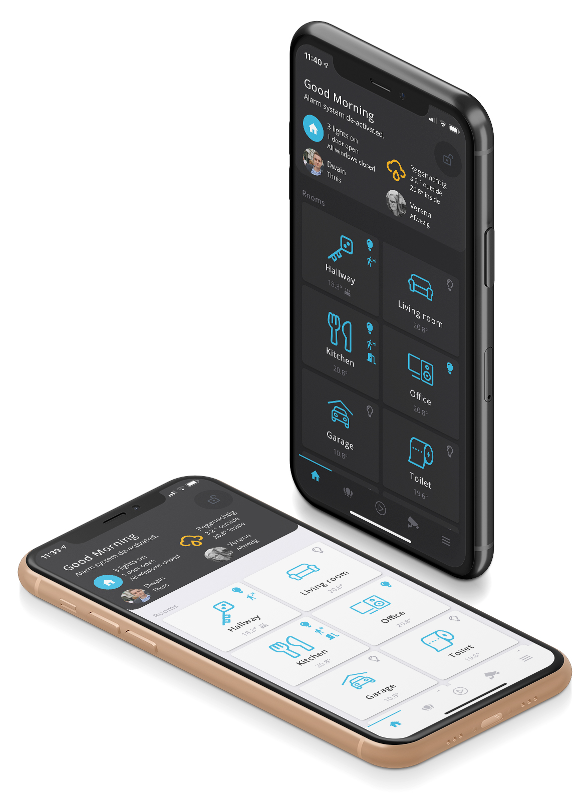

  

  <h2>Welcome to the Dwains Lovelace Theme documentation!</h2>
  
Besides the documentation, you can also get support and ask questions on the <a href="https://community.home-assistant.io/t/dwains-theme-released-an-auto-generating-lovelace-ui-theme/168593?u=dwains">HA Forum</a>. I spend a lot of free time into this project. If you appreciate what I have made you can <a href="https://www.buymeacoffee.com/FAkYvrx" target="_blank">Buy me a coffee/beer</a> or <a href="https://www.paypal.com/cgi-bin/webscr?cmd=_s-xclick&hosted_button_id=QQ5LBNQWLW2ZQ&source=url" target="_blank">donate to my PayPal account</a>. If you like you can subscribe on my <a href="https://www.youtube.com/channel/UCb2GBaLC4d0rVn9pZbYbQ9A" target="_blank">Home Assistant YouTube channel</a>.

  

  NOTE: This theme is currently focused on mobile view. A future update (coming soon) will also fully support desktop and tablet view.
  

  

  

   
  

### Getting started
* [Preparations](getting-started/preparations.md)
* [Installation](getting-started/installation.md)

### [Configuration](configuration/index.md)
* [global.yaml](configuration/global.md)
* [rooms.yaml](configuration/rooms.md)
* [house_information.yaml](configuration/house_information.md)
* [scenes.yaml](configuration/scenes.md)
* [cameras.yaml](configuration/cameras.md)
* [persons.yaml](configuration/persons.md)
* [icons.yaml](configuration/icons.md)
* [more_page.yaml](configuration/more_page.md)
* [dynamic_page.yaml](configuration/dynamic_page.md)

### [Addons](addons/index.md)
* [Rooms addons](addons/rooms.md)
* [More page addons](addons/more_page.md)
* [Dynamic page addons](addons/dynamic_page.md)
* [Persons addons](addons/persons.md)

### Information
* [Update theme](information/update.md)
* [Changelog](information/update.md)
* [Releases](https://github.com/dwainscheeren/lovelace-dwains-theme/releases)

### How to guides
* [How to choose and use an icon](how-tos/how-to-choose-icon.md)
* [How to update theme](information/update.md)

### Support
* [Bugs](https://github.com/dwainscheeren/lovelace-dwains-theme/issues)
* [Feature Requests](https://github.com/dwainscheeren/lovelace-dwains-theme/issues/new)
* [HA Forum](https://community.home-assistant.io/t/dwains-theme-an-auto-generating-lovelace-ui-theme/168593?u=dwains)
* [Slack (dutch)](https://join.slack.com/t/homeassistantnlbe/shared_invite/enQtNzc4MzAwMTEyNDIwLTgwZGVmNmNhZjZkNmVkMjM1NTM3N2UwODIzZTFjMzY1ZmUyMGJiZDU5ZTEyZWEyYzMzYzQzYWJmNGE3MWVjN2I)
* [Slack (english)](https://join.slack.com/t/homeassistanten/shared_invite/enQtNzg1NzQyOTI4ODE2LWVhMmY3ZjMxMThhOTk1OWEwY2E4NDE0YmViZWI3NjUyNzIyMzIwNTkwMzlmMDA5N2I0MTQ4MDhiYTkwYWFlZDU)

### Donate
* [PayPal](https://www.paypal.com/cgi-bin/webscr?cmd=_s-xclick&hosted_button_id=QQ5LBNQWLW2ZQ&source=url)
* [Buy me a coffee](https://www.buymeacoffee.com/FAkYvrx)

#### Donation list

Many thanks to the people who donated, I really appreciate it! I love transparency so I will place all donations on this page.
If you donate please write a short message with your HA username :D

> @mase (again :D) — Nice update (v1.1.5). Headers are now always loading and thx for fixing the group-cover bug in the theme. Also thanks for all the support you giving on slack and the ha forum. Keep it up, you´re awesome!

> @maikelstraub — Thanks for your help on slack and an amazing, well documented theme!

> @jompa68 — Lovely theme and great support. Easy to setup.

> @rkotulan — Nice designed theme.

> @Evad — Very nice theme. Excellent documentation.

> @Simon — I am very satisfied with the theme.

> @nexro — Thanks for your good work and fast response @ Slack! 

> @giosem — Thanks Dwain! Great theme! I really love it.

> @konradwalsh — Thanks for an excellent theme and making HA come to life

> @the_cyberspace  — Nice theme, i love it! And enjoy your krat juup :)

> @Klumpke — Hard work should be rewarded. Great theme that I use every day!

> @mase — I didn‘t know that you can make such a good looking setup in HA. Thanks for such an advanced, yet simple to install theme.

> @Warwick Jaensch — For great work on Dwains Theme!

> @Joeri94 — Very nice and easy to install theme and good work for the Dutch HA community
