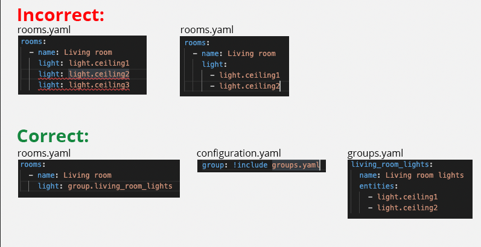

[< Go back to Home](../index.md)

# FAQ - frequently asked question

## How can I get Dwains Dashboard installed through HACS?
1. Go to HACS
2. Click on Integrations
3. Click on the three dots top right corner
4. Click on Custom repositories
5. There opens a new popup inside the Repository input field type: `https://github.com/dwainscheeren/dwains-lovelace-dashboard` and select as Category: Integration
6. Click on ADD button
7. Dwains Dashboard is now added to hacs and you can search for it and install it
Note: You can safely install the dashboard through HACS even if you already have it installed manually without removing your already existing config.

## How can I add multiple entities (for example lights) inside 1 room?
To add multiple entities inside a room you need to create an Home Assistant group.
So for example if you have 5 lights in your living room, you will need to create a group with these 5 lights inside. Then you can use that group inside the room.

**Don't confuse HA group with HA light groups, those 2 are different!**
- Light groups are meant for multiple lights in a single fixture, this gives a new light entity. 
- Groups are meant for grouping multiple (light) entities, this gives a group entity.

## I get an empty dashboard or I get a red error inside dashboard
Make sure you have cleared your cache in the browser and mobile app. If you see an red error message then please clear your browser cache or mobile app cache. On windows you can do CTRL + F5 and on Apple you can do Hold ⇧ Shift and click the Reload button. Or, hold down ⌘ Cmd and ⇧ Shift key and then press R.

Clearing the cache on your android device can be done by navigating to the installed apps in your phone settings menu. 
(On most phones this is at Settings > Apps > Home Assistant > Storage > Clear Cache)

## I can't find Dwains Dashboard in the Integrations after I installed it
Clear your browser cache or mobile app cache. On windows you can do CTRL + F5 and on Apple you can do Hold ⇧ Shift and click the Reload button. Or, hold down ⌘ Cmd and ⇧ Shift key and then press R.
