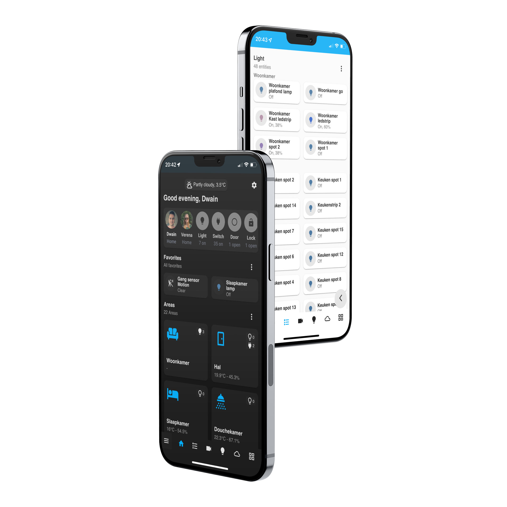

  

  <h2>Dwains Dashboard v3 documentation</h2>
  
Besides the documentation, you can also get support and ask questions on the <a href="https://community.home-assistant.io/t/dwains-theme-released-an-auto-generating-lovelace-ui-theme/168593?u=dwains">HA Forum</a> or even better join my Discord server for any questions or global talk about Home Assistant. <a href="https://discord.gg/7yt64uX">Discord server "Home Assistant Addicts"</a>

  

  I spend a lot of free time into this project. If you appreciate what I have made you can <a href="https://www.buymeacoffee.com/FAkYvrx" target="_blank">Buy me a coffee/beer</a>, <a href="https://www.paypal.me/dwainscheeren" target="_blank">donate to my PayPal account</a> or <a href="https://github.com/sponsors/dwainscheeren">sponsor me on Github</a>.
  

  

  

   
  

Note: This documentation is only for version 3.*!

### Getting started
* [How to install Dwains Dashboard](information/installation.md)
* [Migrate from existing DD 2.* to 3.0](information/migrate-v2-to-v3.md)

### Information
* [FAQ - frequently asked question](information/faq.md)
* [Dwains Dashboard Releases](https://github.com/dwainscheeren/dwains-lovelace-dashboard/releases)
* [How to use Dwains Dashboard notifications](information/notifications.md)

### Blueprints
* [What are Dwains Dashboard blueprints](blueprint/what-are-blueprints.md)
* [Blueprint tutorial](blueprint/tutorial.md)

Also take a look in the [blueprints repository](https://github.com/dwainscheeren/dwains-dashboard-blueprints).

### Support or got problems with DD?
* [Report a bug](https://github.com/dwainscheeren/dwains-lovelace-dashboard/issues)
* [Ask for a Feature Requests](https://github.com/dwainscheeren/dwains-lovelace-dashboard/discussions)
* [Dwains Dashboard Home Assistant forum thread](https://community.home-assistant.io/t/dwains-theme-an-auto-generating-lovelace-ui-theme/168593?u=dwains)
* [Dwains Dashboard Discord Server](https://discord.gg/7yt64uX)

### Donate to Dwains
* [Github Sponsorship](https://github.com/sponsors/dwainscheeren)
* [PayPal](https://www.paypal.me/dwainscheeren)
* [Buy me a coffee](https://www.buymeacoffee.com/FAkYvrx)