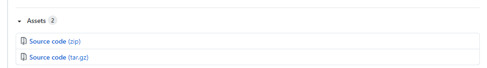

[< Go back to Home](../index.md)

# Installation

**If you experience any problems during the installation of Dwains Dashboard then please join my Discord server, you get live personal support. [Join my Discord Server here, it's 100% free!](https://discord.gg/7yt64uX)**

Dwains Dashboard v3 relies on HA areas. Please make sure you have all your HA devices in an area and the right area before continuing installation Dwains Dashboard.

You can install Dwains Dashboar manual or through HACS, installation through HACS is the recommended way. Both ways are explained below.

# Install Dwains Dashboard through HACS

## Step 1 - Download Dwains Dashboard through HACS
1. Go to HACS
2. Click on Integrations
3. Click on the button "+ Explore & Download repositories"
4. Search for Dwains Dashboard.
5. Click on "Download this repository with HACS".
6. Dwains Dashboard is now added to your HA setup.

## Step 2 - Restart Home Assistant

Restart Home Assistant once before moving to the next step.

## Step 3 - Activate Dwains Dashboard

1. In your Home Assistant UI go to "Configuration", then click "Integrations".
2. Click on the "+" button in the bottom right corner.
3. Search for or scroll down to find "Dwains Dashboard" and select it.

There will be a new icon (a D icon) in your left sidebar.

*If you don't see Dwains Dashboard in the integrations then clear your browser cache or ask for support on my [Discord Server](https://discord.gg/7yt64uX).*

## Step 4 - Access your new Dwains Dashboard

Click in your left sidebar on the new icon D, to access Dwains Dashboard. If you see an red error message then please clear your browser cache or mobile app cache. On windows you can do CTRL + F5 and on Apple you can do Hold ⇧ Shift and click the Reload button. Or, hold down ⌘ Cmd and ⇧ Shift key and then press R.

## Step 5 - Enjoy Dwains Dashboard

That's it! Dwains Dashboard should now be installed.
To learn more about how to configure individual parts in Dwains Dashboard [go back to the main documentation page](../index.md) and check out the pages below **Information**

---

# Install Dwains Dashboard manual

## Step 1 - Download Dwains Dashboard latest release

Download the [latest release from the release page](https://github.com/dwainscheeren/lovelace-dwains-theme/releases/latest).

Initialize the download by clicking on the "Source code (zip)" link at the bottom of the page.

## Step 2 - Extract the content

1. Unzip the file you just downloaded.
2. Inside this folder you will see a folder called `custom_components` copy this folder.
3. Go to the main folder of your Home Assistant installation. This is the folder where you config is. (Hint: its the folder where for example the files `ui-lovelace.yaml` and `configuration.yaml` are located).
4. Paste the `custom_components` to the main folder of your Home Assistant installation. (Not this folder already may exist, otherwise create it)

You will end up with having `/config/custom_components/dwains_dashboard` or if you are running a venv installation it would look like `/home/homeassistant/.homeassistant/custom_components/dwains_dashboard`.

## Step 3 - Restart Home Assistant

Restart Home Assistant once before moving to the next step.

## Step 4 - Activate Dwains Dashboard

1. In your Home Assistant UI go to "Configuration", then click "Integrations".
2. Click on the "+" button in the bottom right corner.
3. Search for or scroll down to find "Dwains Dashboard" and select it.

There will be a new icon (a D icon) in your left sidebar.

*If you don't see Dwains Dashboard in the integrations then clear your browser cache or ask for support on my [Discord Server](https://discord.gg/7yt64uX).*

## Step 5- Access your new Dwains Dashboard

Click in your left sidebar on the new icon D, to access Dwains Dashboard. If you see an red error message then please clear your browser cache or mobile app cache. On windows you can do CTRL + F5 and on Apple you can do Hold ⇧ Shift and click the Reload button. Or, hold down ⌘ Cmd and ⇧ Shift key and then press R.

## Step 6 - Enjoy Dwains Dashboard

That's it! Dwains Dashboard should now be installed.
To learn more about how to configure individual parts in Dwains Dashboard [go back to the main documentation page](../index.md) and check out the pages below **Information**